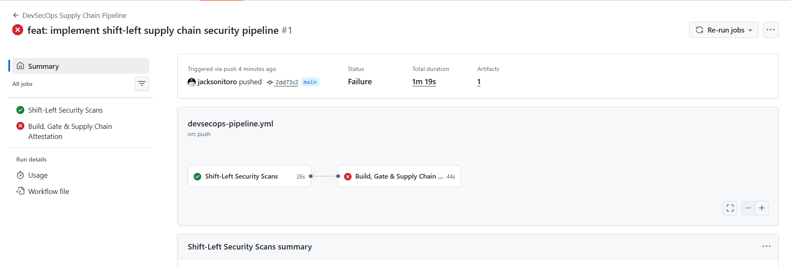
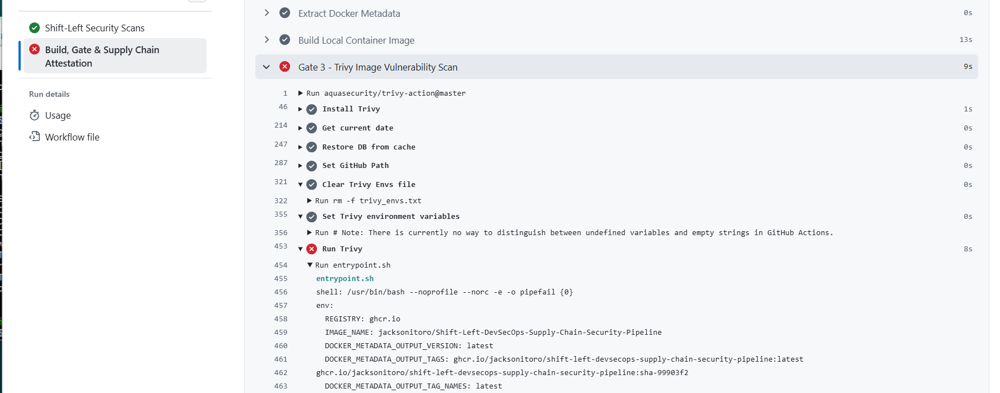
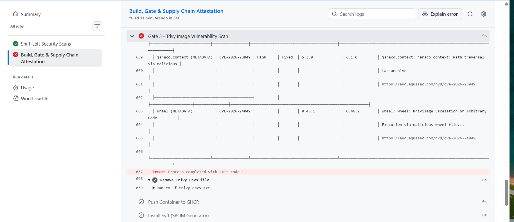
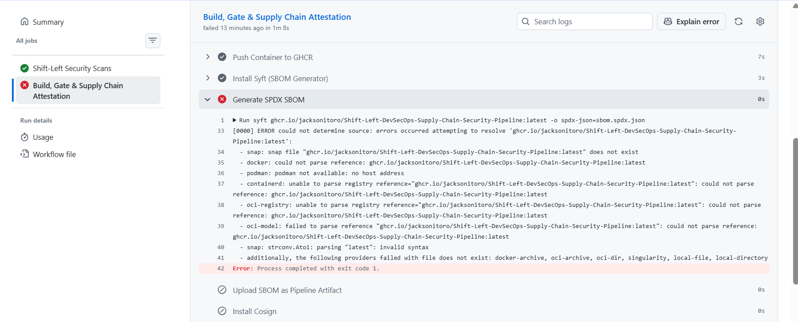
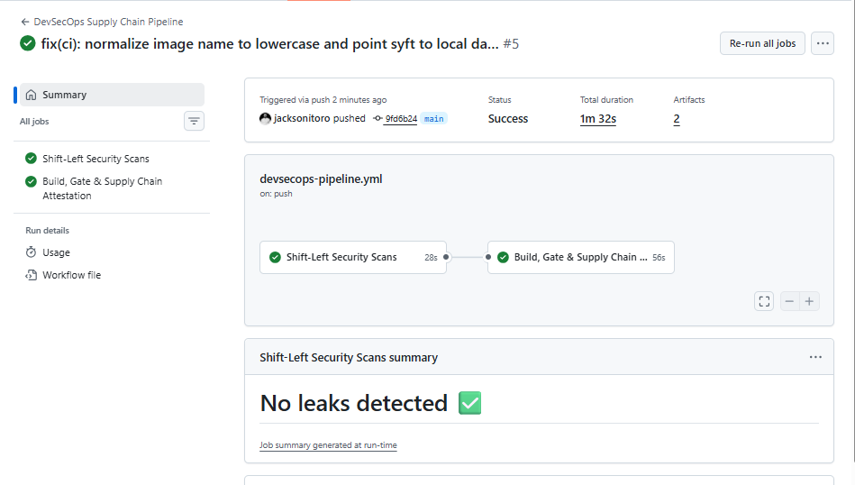

# Shift-Left DevSecOps & Supply Chain Security Pipeline

An enterprise-grade CI/CD DevSecOps pipeline enforcing software supply chain security, zero-trust artifact governance, and SLSA-aligned integrity verification for containerized microservices. 

Every commit must clear static application security testing (SAST), pre-commit secret leak detection, and zero-tolerance container CVE gating before generating a Software Bill of Materials (SBOM) and cryptographically signing the artifact keylessly via Sigstore Cosign.

---

## Supply Chain Architecture & Security Gates

```
       [ Developer Push / Pull Request ]
                       │
                       ▼
 ┌───────────────────────────────────────────┐
 │   Gate 1: Pre-Build Secret Scanning       │
 │   Tool: Gitleaks                          │
 │   Policy: Zero-tolerance credential leaks │
 └─────────────────────┬─────────────────────┘
                       │ PASS
                       ▼
 ┌───────────────────────────────────────────┐
 │   Gate 2: Static Application Analysis     │
 │   Tool: Semgrep (SAST)                    │
 │   Policy: OWASP / CWE python rulesets     │
 └─────────────────────┬─────────────────────┘
                       │ PASS
                       ▼
 ┌───────────────────────────────────────────┐
 │   Hardened Multi-Stage Container Build    │
 │   Base: Alpine Linux (Non-root appuser)   │
 │   Isolation: Stripped build metadata      │
 └─────────────────────┬─────────────────────┘
                       │ PASS
                       ▼
 ┌───────────────────────────────────────────┐
 │   Gate 3: Container Vulnerability Gating  │
 │   Tool: Aqua Security Trivy               │
 │   Policy: Fail-on-High/Critical CVEs      │
 └─────────────┬─────────────────────────────┘
               │ FAIL ──> [ Pipeline Blocked / Release Aborted ]
               │ PASS
               ▼
 ┌───────────────────────────────────────────┐
 │   Registry Release & Distribution         │
 │   Target: GitHub Container Registry (GHCR)│
 └─────────────────────┬─────────────────────┘
                       │
         ┌─────────────┴─────────────┐
         ▼                           ▼
 ┌───────────────────┐       ┌───────────────────────────────┐
 │  Supply Chain     │       │  Cryptographic Attestation    │
 │  Transparency     │       │  Tool: Sigstore Cosign        │
 │  Tool: Syft       │       │  Identity: Keyless OIDC Token │
 │  Format: SPDX JSON│       │  Audit: Rekor Public Log      │
 └───────────────────┘       └───────────────────────────────┘
```

---

## Security Gate Feature Matrix

| Security Phase | Tool | Target / Scope | Policy Enforcement |
| :--- | :--- | :--- | :--- |
| **Secret Detection** | Gitleaks v2 | Full Git Commit History & Workspace | Blocks exposed API tokens, private keys, cloud credentials |
| **Static Code Analysis** | Semgrep | `app/*.py` source code | Enforces custom CWE rules, blocks hardcoded strings & risky bindings |
| **Base Hardening** | Docker Multi-Stage | OS Base & Runtime Dependencies | Drops root privileges to unprivileged `appuser:appgroup` |
| **Vulnerability Gating** | Aqua Security Trivy | Built Image (`secure-api:scan`) | `--exit-code 1` on `CRITICAL` or `HIGH` vulnerabilities |
| **SBOM Inventory** | Anchore Syft | Container Filesystem & Python Wheels | Generates standard SPDX JSON inventory artifact |
| **Image Attestation** | Sigstore Cosign | OCI Container Registry Artifact | Keyless cryptographic signing via GitHub Actions OIDC |

---

## Repository Structure

```text
devsecops-supply-chain/
├── .github/
│   └── workflows/
│       └── devsecops-pipeline.yml   # Multi-stage CI/CD security workflow
├── app/
│   ├── main.py                      # FastAPI microservice
│   └── requirements.txt             # Patched application dependencies
├── docs/
│   └── images/                      # Architecture diagrams and audit proofs
│       ├── first_failed_pipeline.png
│       ├── second_failed_pipeline1.png
│       ├── second_failed_pipeline2.png
│       ├── third_failed_pipeline_SPDX_SBOM.png
│       └── successful_pipeline_CI.png
├── .gitignore
├── .gitleaks.toml                   # Gitleaks rule definitions and allowlists
├── .semgrep.yml                     # Semgrep SAST rule definitions
├── Dockerfile                       # Multi-stage hardened Alpine containerfile
└── README.md                        # Project Documentation
```

---

## Security Governance in Action: Proof of Enforcement

Real-world DevSecOps requires enforcing compliance through automated gating while methodically investigating and remediating root causes. The engineering journey across our build gates demonstrates this cycle:

### 1. Gate 3 Blocking Vulnerable Artifacts (Fail-Closed Enforcement)

During the baseline pipeline execution, unpatched base OS components and transitive Python libraries were detected by Trivy. The automated gate executed with exit code 1, aborting downstream release and preventing vulnerable artifacts from reaching the registry:

<p align="center">
  
</p>

### 2. Deep CVE Triage: Isolating OS & Build Metadata Residue

Switching to an Alpine base dropped vulnerabilities significantly, yet Trivy still blocked the build on lingering `HIGH` severity vulnerabilities across build-tool metadata (`setuptools`, `wheel`, and `jaraco.context`):

<p align="center">
  
</p>

<p align="center">
  
</p>

**Remediation Applied:** 
* Upgraded system binaries in the container runtime using `apk update && apk upgrade --no-cache`.
* Pruned build tooling (`setuptools`, `pip`, `wheel`) from the production layer, eliminating metadata-based vulnerabilities.

### 3. Supply Chain Standards: OCI Image Reference Normalization

During initial SPDX SBOM extraction with Anchore Syft, the parser failed due to uppercase characters in the GitHub repository naming scheme:

<p align="center">
  
</p>

**Remediation Applied:**
* Enforced POSIX-compliant lowercase shell parameter expansion (`${GITHUB_REPOSITORY,,}`) in the CI workflow environment.
* Pointed Syft to scan the local container daemon reference directly (`docker:secure-api:scan`), eliminating registry round-trips.

### 4. Fully Remediated Pipeline & Cryptographic Attestation

With all security gates satisfied and supply chain tooling properly configured, the entire workflow passed end-to-end: Gitleaks validated 0 secret leaks, Semgrep cleared SAST rules, Trivy verified 0 blocking CVEs, Syft exported the SPDX SBOM artifact, and Sigstore Cosign signed the container:

<p align="center">
  
</p>

---

## Verification & Supply Chain Audit

Any engineer, compliance auditor, or downstream Kubernetes Admission Controller can independently verify the authenticity and provenance of the published image without managing private keys.

### Cryptographic Signature Verification (Sigstore Cosign)

```bash
docker run --rm ghcr.io/sigstore/cosign/cosign:latest verify \
  --certificate-identity-regexp "[https://github.com/jacksonitoro/Shift-Left-DevSecOps-Supply-Chain-Security-Pipeline](https://github.com/jacksonitoro/Shift-Left-DevSecOps-Supply-Chain-Security-Pipeline).*" \
  --certificate-oidc-issuer "[https://token.actions.githubusercontent.com](https://token.actions.githubusercontent.com)" \
  ghcr.io/jacksonitoro/shift-left-devsecops-supply-chain-security-pipeline:latest
```

### Inspecting the Software Bill of Materials (SBOM)

The pipeline automatically uploads an SPDX standard SBOM artifact (`sbom.spdx.json`) with each successful build. Download it directly from the GitHub Actions workflow run summary or inspect it locally:

```bash
syft docker:ghcr.io/jacksonitoro/shift-left-devsecops-supply-chain-security-pipeline:latest -o spdx-json
```